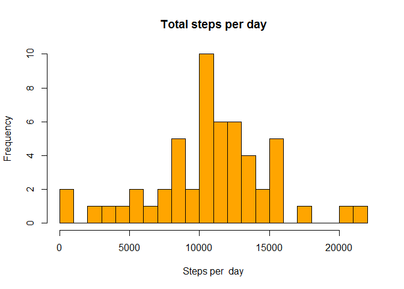
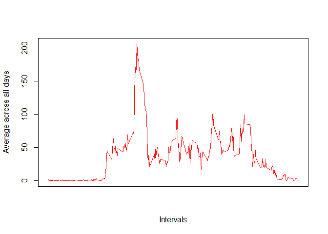

# Reproducible Research: Peer Assessment 1
Laercio J Oliveira  
January 10, 2016  


## Loading and preprocessing the data

Reading the data into data frame

```r
data <- read.csv("activity.csv", na.strings = "NA")
str(data)
```

```
## 'data.frame':	17568 obs. of  3 variables:
##  $ steps   : int  NA NA NA NA NA NA NA NA NA NA ...
##  $ date    : Factor w/ 61 levels "2012-10-01","2012-10-02",..: 1 1 1 1 1 1 1 1 1 1 ...
##  $ interval: int  0 5 10 15 20 25 30 35 40 45 ...
```


```r
summary(data)
```

```
##      steps                date          interval     
##  Min.   :  0.00   2012-10-01:  288   Min.   :   0.0  
##  1st Qu.:  0.00   2012-10-02:  288   1st Qu.: 588.8  
##  Median :  0.00   2012-10-03:  288   Median :1177.5  
##  Mean   : 37.38   2012-10-04:  288   Mean   :1177.5  
##  3rd Qu.: 12.00   2012-10-05:  288   3rd Qu.:1766.2  
##  Max.   :806.00   2012-10-06:  288   Max.   :2355.0  
##  NA's   :2304     (Other)   :15840
```


## What is mean total number of steps taken per day?

#### 1. Calculate the total number of steps taken per day

```r
sumStepsPerDay <- aggregate(steps ~ date, data, sum)
```

####  2. Make a histogram of the total number of steps taken each day

```r
hist(sumStepsPerDay$steps,col="orange",breaks=30,main="Total steps per day",xlab="Steps per  day")
```

\

#### 3. Calculate and report the mean and median of the total number of steps taken per day

```r
summary(sumStepsPerDay)
```

```
##          date        steps      
##  2012-10-02: 1   Min.   :   41  
##  2012-10-03: 1   1st Qu.: 8841  
##  2012-10-04: 1   Median :10765  
##  2012-10-05: 1   Mean   :10766  
##  2012-10-06: 1   3rd Qu.:13294  
##  2012-10-07: 1   Max.   :21194  
##  (Other)   :47
```
Mean = 10766 and Median = 10765


## What is the average daily activity pattern?

#### 1. Make a time series plot (i.e. type = "l") of the 5-minute interval (x-axis) and the average number of steps taken, averaged across all days (y-axis)  


```r
library(dplyr,quietly = TRUE)
```

```
## Warning: package 'dplyr' was built under R version 3.2.2
```

```
## 
## Attaching package: 'dplyr'
```

```
## The following objects are masked from 'package:stats':
## 
##     filter, lag
```

```
## The following objects are masked from 'package:base':
## 
##     intersect, setdiff, setequal, union
```

```r
grouped <- group_by(data, interval)
d_a_pattern <- summarise(grouped, mean=mean(steps, na.rm=TRUE))
plot(d_a_pattern$interval , d_a_pattern$mean,type = "l", col = "red", xaxt = "n",xlab="Intervals", ylab = "Average across all days")
```

\

#### 2. Which 5-minute interval, on average across all the days in the dataset, contains the maximum number of steps?


```r
filter(d_a_pattern, mean==max(mean))
```

```
## Source: local data frame [1 x 2]
## 
##   interval     mean
##      (int)    (dbl)
## 1      835 206.1698
```


## Imputing missing values

#### 1. Calculate and report the total number of missing values in the dataset (i.e. the total number of rows with NAs)


```r
sum(is.na(data$steps))
```

```
## [1] 2304
```

#### 2. Devise a strategy for filling in all of the missing values in the dataset

Impute missing values based on average number of steps in particular 5-minutes interval.


#### 3. Create a new dataset that is equal to the original dataset but with the missing data filled in.


#### 4. Make a histogram of the total number of steps taken each day and Calculate and report the mean and median total number of steps taken per day. Do these values differ from the estimates from the first part of the assignment? What is the impact of imputing missing data on the estimates of the total daily number of steps?


## Are there differences in activity patterns between weekdays and weekends?


#### 1. Create a new factor variable in the dataset with two levels - weekday and weekend indicating whether a given date is a weekday or weekend day.
